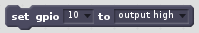
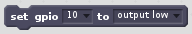
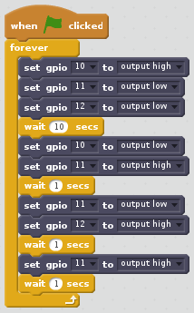
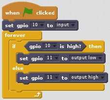
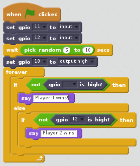

# Scratch

Examples for using the PLAY BOARD with Scratch 2

## Components

### LED

Hello world:

More:

| Action            | Block                                 |
| ----------------- |:------------------------------------- |
| ON                |         |
| OFF               |        |
| BLINK 2 SECONDS   |    |
| BLINK 0.1 SECONDS |  |

### Buzzer

Hello world:

More:

| Action            | Block                                   |
| ----------------- |:--------------------------------------- |
| ON                |        |
| OFF               |       |
| BLINK 2 SECONDS   |    |
| BLINK 0.1 SECONDS |  |

### Button

Hello world:

## Recipes

### Traffic Lights

Code a traffic lights sequence:

### Interactive Traffic Lights

Code an interactive traffic lights sequence:

### LED + Button

Press the button to light the LED:

### Buzzer + Button

Press the button to buzz the Buzzer:

### Reaction game

When you see the light come on, the first person to press their button wins!

### GPIO Music Box

Each button plays a different sound!

